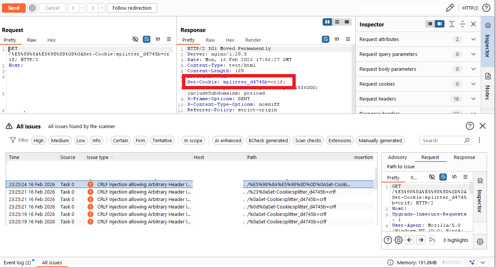
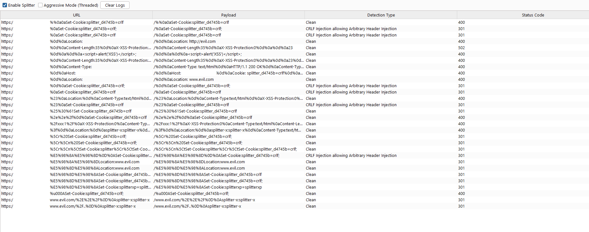
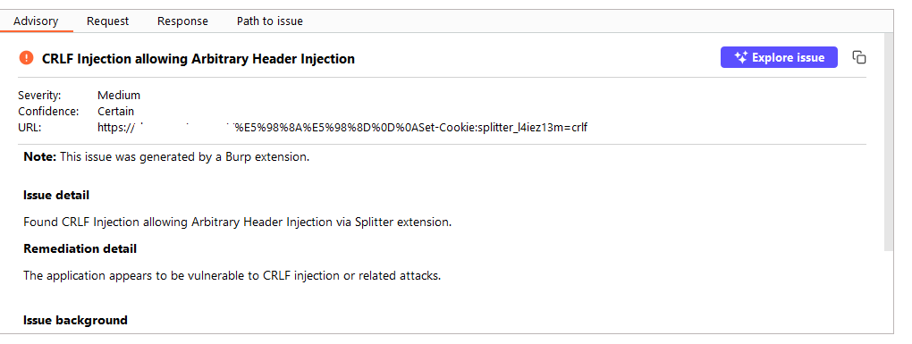

# Splitter

A Burp Suite extension for detecting CRLF injection and HTTP response splitting vulnerabilities.

Splitter performs active detection of header injection primitives that can lead to response splitting, cache poisoning, or secondary injection vectors. It integrates directly into Burp’s scanning workflow and produces structured, reproducible findings.

The project is written in Java using the Burp Extender API and built with Gradle Kotlin DSL.

## Contents
* [Overview](#overview)
* [Installation](#installation)
* [Loading the JAR file into Burp](#loading-the-jar-file-into-burp)
* [Features](#features)

## Overview

CRLF injection remains relevant in modern stacks, especially where:

- Reverse proxies normalize headers inconsistently
- Custom middleware rewrites headers
- URL canonicalization is incomplete
- Input validation fails to strip control characters

Splitter automates detection by:

- Injecting controlled \r and \n payloads
- Analyzing raw response boundaries
- Detecting header injection and response splitting behavior
- Reporting issues using Burp’s native issue interface

Core implementation lives under src/main/java
.

## Installation

1. Build the Extension

From the project root:
./gradlew build

On Windows:
gradlew.bat build

The compiled JAR will be available in:
build/libs/

## Loading the JAR file into Burp

To load the JAR file into Burp:

1. In Burp, go to **Extensions > Installed**.
2. Click **Add**.
3. Under **Extension details**, click **Select file**.
4. Select the JAR file you just built, then click **Open**.
5. [Optional] Under **Standard output** and **Standard error**, choose where to save output and error messages.
6. Click **Next**. The extension is loaded into Burp.
7. Review any messages displayed in the **Output** and **Errors** tabs.
8. Click **Close**.

## Features

- Active CRLF Injection Testing
Injects controlled carriage return and line feed sequences to test improper input handling.

- Raw HTTP Response Analysis
Inspects response boundaries at the protocol level rather than relying solely on parsed header abstractions.

- Header Injection Detection
Identifies injected or duplicated headers resulting from improper sanitization.

- Response Splitting Identification
Detects cases where injected CRLF sequences cause unintended header/body separation.

- Structured Vulnerability Classification
Uses enum-based classification for consistent reporting and reduced false positives.

- Native Burp Integration
Registers as an active scanner check and reports findings using Burp’s native issue interface.
https://portswigger.net/burp/extender/api/

- Reproducible Builds
Uses Gradle Kotlin DSL (build.gradle.kts) and the Gradle Wrapper for deterministic builds.
https://docs.gradle.org/current/userguide/kotlin_dsl.html

